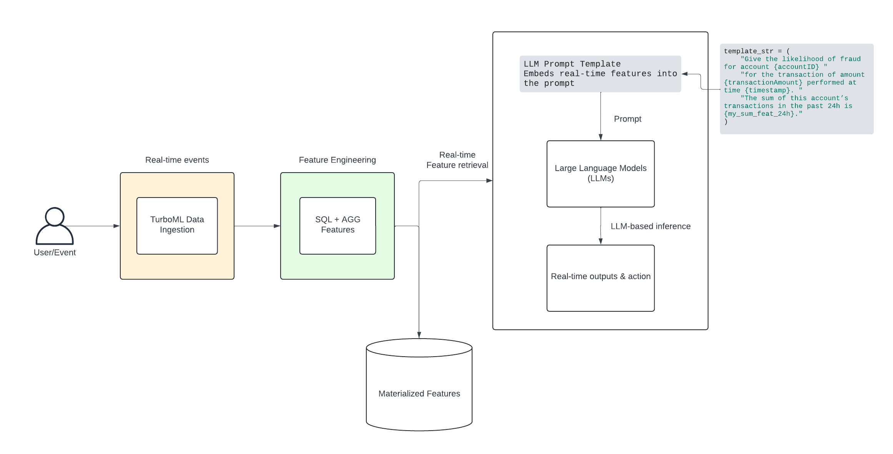

# **Real-Time Data for LLMs with TurboML**

## **Introduction**

Large Language Models (LLMs) have changed the AI landscape, enabling powerful generative and reasoning capabilities. Yet, to solve real-world use cases **in real time**, you often need more than just a pretrained language model. You need **fresh, contextual data** about your users, products, or environment. This is where **feature platforms** come in.

Traditionally, **feature platforms** have been used in machine learning pipelines to:

1. **Centralize** and **manage** features (so you know exactly what features exist and at which timestamps).  
2. Provide a **real-time** pipeline for retrieving those features at inference.

Today, with LLMs, a new paradigm arises: Instead of only using features to feed into classical ML models, we can also use them to **enrich LLM prompts** with real-time or historical context. The result? **Personalized, context-aware LLM** applications that can adapt to the user or business state on the fly.

## **Why Feature Platforms for LLMs?**

### **Real-time Personalization**

LLMs excel at generating text and reasoning, but they become truly powerful when given *fresh data*. For instance, to answer a user’s question about their recent transactions or to assess whether a newly sent message might signal dissatisfaction, the LLM needs to see those recent events in the prompt. A feature platform supplies these **user-level** or **session-level** data points—on demand.

### **Low-latency Data Access**

Feature Platforms are optimized for *quick lookups*, typically using a high-performance online store. This makes them perfect for real-time inference or prompt construction, where you only have milliseconds to retrieve the latest data.

### **Consistency Across Training and Inference**

Feature Platforms unify offline and online features, ensuring the same definitions are used in both your historical analytics and your real-time pipeline. While many LLM-driven apps rely solely on inference-time context, when you start building advanced analytics or feedback loops, it’s crucial to have a **single source of truth** for features.

### **Use Cases**

1. **Real-time Chat Sentiment** – Enrich prompts with a user’s current/historical sentiment to make your chatbot more empathetic.  
2. **Fraud Detection** – Provide the LLM with aggregated transaction stats (like total spend in last 24 hours) for more accurate risk decisions.  
3. **Recommendations and Marketing** – Show the LLM the user’s recent browsing or purchase patterns to deliver hyper-personalized recommendations.

## **Architecture and Data Flow**

Real-time messages come in, get processed by the feature platform, and are stored in both **online** and **offline** feature platforms. Your LLM-based app can then retrieve relevant features at query time, incorporate them into a prompt, and get a **context-rich** response from the LLM.

<div align="center">
  
</div>


1. **Raw Data** (e.g., chat messages, transactions) is ingested via TurboML’s Data Ingestion API.  
2. **Feature Platform** (TurboML, Tecton, etc.) calculates or aggregates relevant features.  
3. **Online Feature Platform** provides immediate, real-time lookups.  
4. **LLM Prompt** is constructed, injecting real-time or aggregated features.  
5. **LLM** (OpenAI, Anthropic, Google’s Gemini, etc.) receives these enriched prompts and returns a context-aware answer.

## **Injecting Real-Time Features into LLM Prompts**

### **1\) Real-Time Ingestion**

Imagine you receive a streaming transaction event:
```json
{  
    "accountID": "A1234567",  
    "transactionAmount": 79.99,  
    "timestamp": 1693619200  
}
```

You push this record into TurboML via its Ingest API.

### **2\) Aggregating Transaction Features**

TurboML will automatically **update** any time-windowed aggregations. For example, we might have:

* `sum_feat_24h`: sum of all `transactionAmount` for this `accountID` in the last 24 hours  
* `avg_feat_48h`: average transaction amount over the last 48 hours  
* `count_feat_7d`: count of transactions in the last 7 days  
* `max_feat_7d`: max transaction in the last 7 days

As soon as the new event is ingested, the rolling aggregates are recalculated and stored in the **online feature platform** so they can be read in real time.

### **3\) Constructing an LLM Prompt**

Now, let’s create a prompt template that references these transaction features. Suppose we want the LLM to determine whether this new transaction is high-risk:

```python
template_str = """  
Please analyze the following transaction for potential fraud:

- Account ID: {accountID}  
- Transaction Amount: {transactionAmount}  
- Timestamp: {timestamp}  
- Sum of Transactions (last 24h): {my_sum_feat_24h}  
- Avg Transaction (last 48h): {my_avg_feat_48h}  
- Transaction Count (last 7d): {my_count_feat_7d}  
- Max Transaction (last 7d): {my_max_feat_7d}

Based on these features, do you suspect fraudulent activity?
"""
```  

We’ve created placeholders (`{sum_feat_24h}`, etc.) that will be auto-filled by TurboML.

### **4\) Fetching Real-Time Features & Formatting the Prompt**

We define a helper class `TurboMLPromptTemplate` that fetches real-time features for a given row and **inserts** them into a prompt string.

```python
from turboml.common.feature_engineering import retrieve_features

class TurboMLPromptTemplate:  
    def __init__(self, template: str, dataset_id: str):  
        self.dataset_id = dataset_id  
        self.template = template

    def get_prompts(self, df: pd.DataFrame) -> List[str]:  
        prompt_data_list = retrieve_features(self.dataset_id, df).to_dict('records')  
        prompts = []  
        for prompt_data in prompt_data_list:  
            prompt = self.template.format(**prompt_data)  
            prompts.append(prompt)  
        return prompts
```

Now we provide a **DataFrame** row with the new transaction data

```python
# Example DataFrame with our new transaction row
df = pd.DataFrame([{
    "accountID": "A1234567",
    "transactionAmount": 79.99,
    "timestamp": 1693619200
}])

prompt_template = TurboMLPromptTemplate(
    template=template_str,
    dataset_id="transactions_prompt"
)
prompts = prompt_template.get_prompts(df)
print(prompts[0])
```

You might see something like:

```
Please analyze the following transaction for potential fraud:

- Account ID: A1234567  
- Transaction Amount: 79.99  
- Timestamp: 1693619200  
- Sum of Transactions (last 24h): 159.98  
- Avg Transaction (last 48h): 63.45  
- Transaction Count (last 7d): 5  
- Max Transaction (last 7d): 120.00

Based on these features, do you suspect fraudulent activity?
```

All those feature values (sum, average, count, max) are **fresh** and represent the user’s recent transaction history.

### **5\) Call the LLM**

Finally, we can send this prompt to our favorite model endpoint.

This yields a response with the LLM’s fraud assessment in real time, augmented by the **latest transaction features** from TurboML.

## **Putting It All Together**
With these real-time features baked into LLM prompts, we can:

* **Personalize** user interactions (“Hey {username}, since your last purchase was {my\_sum\_feat\_24h}…”).  
* **Adapt** to changes in sentiment or behavior at a moment’s notice.
* **Trigger** specialized messaging (e.g., sending apology notes or loyalty coupons if sentiment is negative or if certain thresholds are exceeded).

## **Why This Matters**

* **Real-Time Alerts**: If the LLM flags suspicious activity, you can instantly alert a fraud department or freeze the account.  
* **Personalized Decisioning**: By referencing each user’s recent behavior, you avoid one-size-fits-all thresholds and make data-driven decisions.  
* **Minimal Infrastructure Overhead**: TurboML handles ingestion, time-based feature aggregation, and low-latency storage. You simply retrieve features and feed them to the LLM.

This pattern generalizes beyond fraud detection to any workflow that benefits from **fresh, user-specific data**—marketing, chat sentiment, recommendation systems, etc. By combining LLM reasoning with feature platform data, you can build truly **context-aware** AI applications.

**Happy building with real-time data LLMs\!**