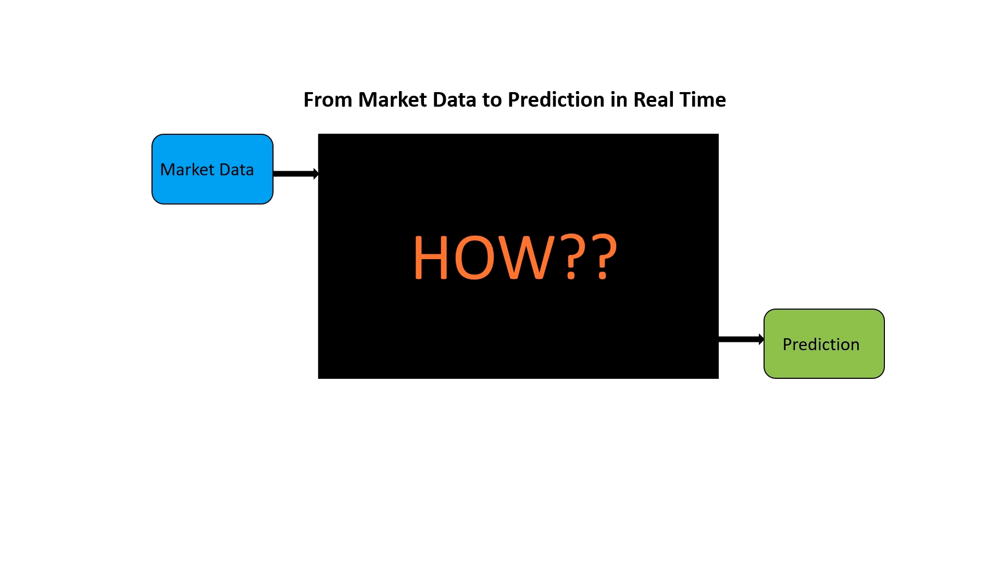
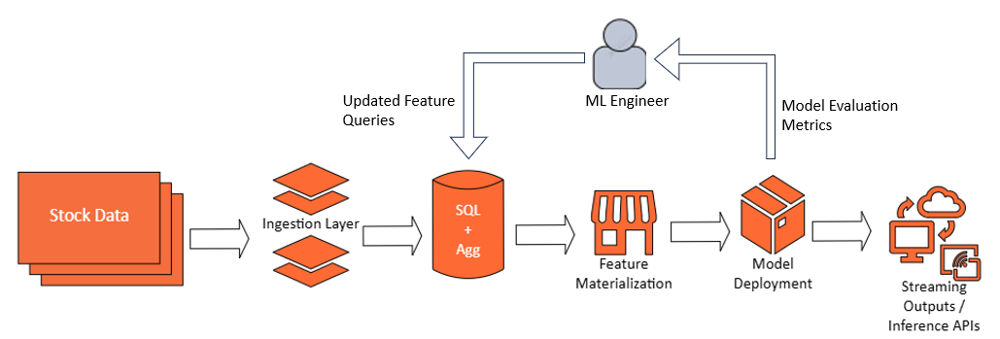

# **Real-Time Anomaly Detection on Stock Data with TurboML**

**In this tutorial,** we walk through building a **real-time anomaly detection** pipeline for stock price data using **TurboML**. Our setup enables continuous ingestion of **intraday stock data** from a data source (e.g., Alpha Vantage), transformation of that data into meaningful features, and immediate **Random Cut Forest (RCF)**\-based anomaly scoring.

### **Why Real-Time Matters**

Financial markets move quickly. Anomalies in stock prices—such as sudden spikes, precipitous drops, or unusual volume—can indicate **breaking news, market manipulation,** or **buy/sell opportunities**. **Traditional batch ML** approaches require hours or days to process, missing time-sensitive signals. In contrast, **TurboML** provides a streaming-first approach:

* **Pull** or **push** data streams in near real-time.  
* **Continuously** compute features, such as rolling price-volume metrics.  
* Run incremental, **online** ML algorithms and produce **immediate anomaly scores**.

The outcome: a highly responsive pipeline for finance professionals to spot anomalies and act quickly.

  

**Use Case Overview**

**Goal**: Detect anomalies in stock trading data in near real time.  
**Data**: Intraday stock quotes (price, volume) retrieved from **Alpha Vantage** or a similar financial API.  
 **Approach**:

1. **Ingest** streaming stock data into **TurboML**.  
2. **Compute** rolling aggregates and transformations in real time.  
3. **Deploy** an **unsupervised** **Random Cut Forest** model.  
4. **Retrieve** anomaly scores with minimal latency.

## **Data & Inputs**

We assume:

* **Alpha Vantage** (or another finance API) provides a continuous stream of intraday data. Each record contains:  
  * `timestamp` (e.g., 1-minute intervals)  
  * `symbol` (e.g., AAPL, MSFT)  
  * `price`  
  * `volume`  
* TurboML can ingest these records in two main ways:  
  * **Push-based** ingestion (you explicitly upload new data frames or single records).  
  * **Pull-based** ingestion (TurboML connectors watch for new data).

For demonstration, we’ll do **push-based** ingestion from the api.

## **Feature Engineering**

Anomaly detection often benefits from derived features. For stock data, we might add:

* **`price_volume_prod`** \= `price * volume`  
* **`rolling_volume_1h`** \= sum of volume in the past hour  
* Possibly more advanced transformations or lookups, such as:  
  * Rolling standard deviations of price  
  * Weighted averages or volatility indicators

In **TurboML**, these transformations can be defined once, then seamlessly applied to both **batch** (historical) and **streaming** (real-time) data.

## **Model Training & Testing**

### **Iterative Feature Definition**

Before going live, you’ll likely test and refine your feature definitions and model offline using historical data, for example:

1. Pull stock price data from a past time window (e.g., last month).  
2. Define features in TurboML with **SQL** or rolling aggregates.  
3. Export the computed features to a local DataFrame.  
4. Train an **RCF** or other anomaly detection model on that snapshot.  
5. Evaluate the model (if you have partial ground-truth anomalies) or do an unsupervised evaluation (e.g., distribution analysis).

### **Single Code Path for Features**

A **key advantage** of TurboML is that the same feature definitions (SQL expressions, rolling windows, Python UDFs, etc.) used offline can be used unchanged for **real-time** data streams. This eliminates duplicating logic between batch prototypes and production streaming code.

## **Real-Time Ingestion & Inference**

After validating the approach in batch mode, you can **deploy** a streaming pipeline for real-time data:

1. **Data Source**: Configure TurboML to ingest live or near-live intraday data from the Alpha Vantage endpoint (or from a local job that periodically calls the API).  
2. **Materialize Features**: TurboML automatically computes rolling aggregates and SQL transformations as new records arrive.  
3. **Deploy RCF Model**: The model receives each new feature vector and outputs an **anomaly score** immediately.  
4. **Retrieve**: Subscribe to real-time outputs, or call the model’s synchronous prediction endpoint for single-record inference.

Because we rely on the same definitions and the same pipeline, there’s no discrepancy between offline and real-time data transformations.

  

1. **Stock Data** continuously arrives from your API.  
2. **TurboML** ingests it and **materializes** the rolling and SQL features.  
3. The **RCF** model immediately processes the new features and scores each record.  
4. You retrieve the **anomaly scores** in near real time, enabling you to raise alerts or display them on a dashboard.

### **Where to go from here:**

1. **Enhance Feature Engineering**: Add more domain-specific features, e.g. rolling volatility or aggregated news sentiment.  
2. **Evaluate** with partial ground-truth anomalies, or label certain abrupt price changes.  
3. **Implement Drift Detection**: Keep an eye on data distribution changes or shifts in the RCF anomaly output.  
4. **Set Alerts**: Integrate with Slack, PagerDuty, or custom dashboards to notify stakeholders of high anomaly scores.

**Happy Streaming & Detecting\!**
